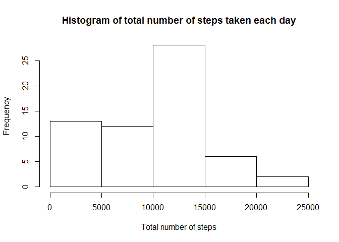
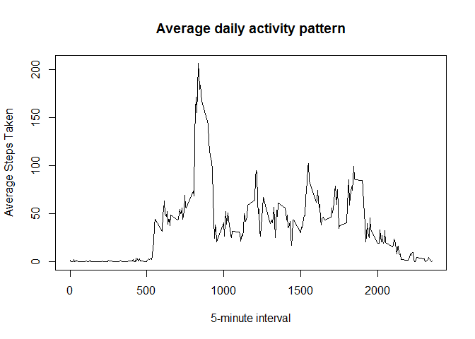
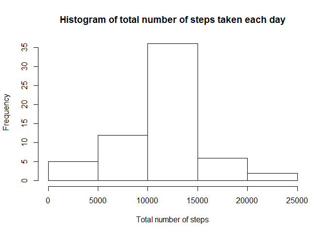
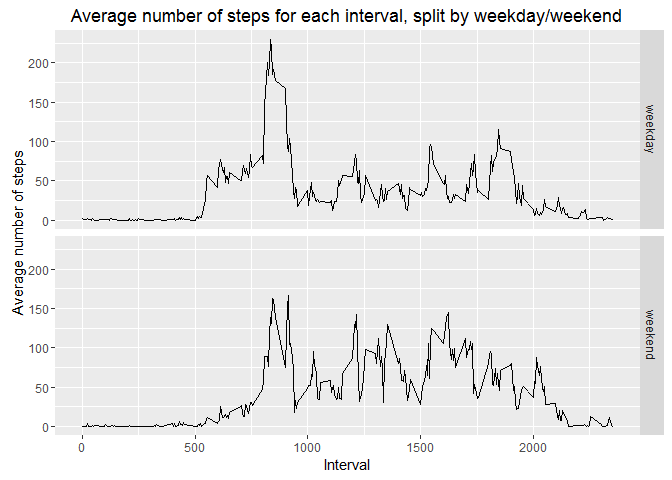

# Reproducible Research: Peer Assessment 1
Matthew Finney  
April 21, 2017  


## Loading and preprocessing the data
**Review Criteria 1:** Code for reading in the dataset and/or processing the data  

```r
activity <- read.csv('activity.csv')
```

## What is mean total number of steps taken per day?

1. First, calculate the total number of steps taken for each day.


```r
totalStepsByDay <- with(activity, tapply(steps,date,sum, na.rm=TRUE))
```

**Review Criteria 2:** Histogram of the total number of steps taken each day  
2. Then, produce a histogram with the total number of steps per day.

```r
hist(totalStepsByDay, xlab = 'Total number of steps', main = 'Histogram of total number of steps taken each day')
```

<!-- -->

**Review Criteria 3:** Mean and median number of steps taken each day  
3. The **mean** number of steps taken by day is 9354.2295082. The **median** number of steps taken by day is 10395.


## What is the average daily activity pattern?
**Review Criteria 4:** Time series plot of the average number of steps taken  
1. Make a time series plot of the 5-minute interval and number of steps taken in that interval, averaged across all days.


```r
meanStepsByInterval <- with(activity, tapply(steps,interval,mean, na.rm=TRUE))

plot(rownames(meanStepsByInterval),meanStepsByInterval, type='l', xlab = '5-minute interval', ylab = 'Average Steps Taken', main = 'Average daily activity pattern')
```

<!-- -->

**Review Criteria 5:** The 5-minute interval that, on average, contains the maximum number of steps  
2. The 835 interval contains the maximum number of steps on average across all the days in the dataset.


## Imputing missing values
1. The total number of missing values in the dataset is 2304.

2. Missing values will be filled in with the mean number of steps for the corresponding 5 minute interval across all days, per the calculation describedi in the code chunck in the following paragraph.

**Review Criteria 6:** Code to describe and show a strategy for imputing missing data  
3. Create a new dataset that is equal to the original dataset but with the missing data filled in.

```r
activity2 <- activity
activity2$steps <- ifelse(is.na(activity2$steps), meanStepsByInterval[as.character(activity2$interval)],activity2$steps)
```

**Review Criteria 7:** Histogram of the total number of steps taken each day after missing values are imputed
4. Make a histogram of the total number of steps taken each day.

```r
totalStepsByDay2 <- with(activity2, tapply(steps,date,sum, na.rm=TRUE))
hist(totalStepsByDay2, xlab = 'Total number of steps', main = 'Histogram of total number of steps taken each day')
```

<!-- -->

The **mean** number of steps taken by day is 1.0766189\times 10^{4}. The **median** number of steps taken by day is 1.0766189\times 10^{4}. These values are different from the values in part 1 of the assignment. Imputing missing data on the estimates of the total daily number of steps appears to have brought the dataset into closer alignment with a standard normal curve.

## Are there differences in activity patterns between weekdays and weekends?

1. Create a new factor variable in the dataset with two levels – “weekday” and “weekend” indicating whether a given date is a weekday or weekend day.

```r
activity2$weekday <- ifelse(weekdays(as.Date(activity2$date)) %in% c('Saturday', 'Sunday'), 'weekend', 'weekday')
activity2$weekday <- as.factor(activity2$weekday)
```

**Review Criteria 8:** Panel plot comparing the average number of steps taken per 5-minute interval across weekdays and weekends  
2. Make a panel plot containing a time series plot of the 5-minute interval and the average number of steps taken, averaged across all weekday days or weekend days.

```r
require(ggplot2)
```

```
## Loading required package: ggplot2
```

```r
require(plyr)
```

```
## Loading required package: plyr
```

```r
meanStepsByInterval2 <- ddply(activity2,.(interval,weekday),summarize, meanSteps = mean(steps))

patternPlot <- ggplot(meanStepsByInterval2, aes(y=meanSteps,x=interval)) + geom_line() + facet_grid(weekday ~ .) + xlab('Interval') +ylab('Average number of steps') + ggtitle('Average number of steps for each interval, split by weekday/weekend')

print(patternPlot)
```

<!-- -->

**Weekdays** appear to be more active than **weekends**.

**Review Criteria 9:** All of the R code needed to reproduce the results (numbers, plots, etc.) in the report  
See the above, or RepData_PeerAssessment1.R

```r
source(RepData_PeerAssessment1.R)
```
